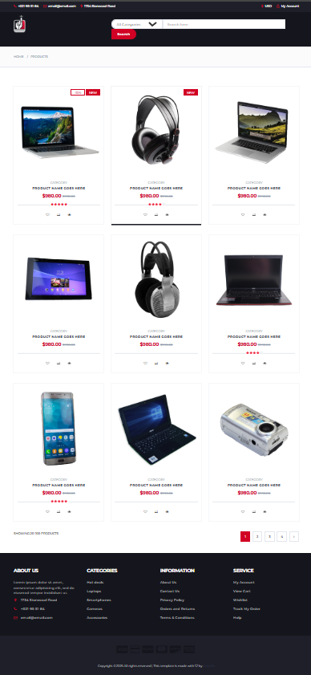
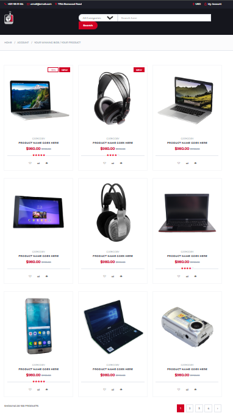

# webapp08
# Aplicación web de subastas "PujaHoy"
## Integrantes
### Jorge Andrés Echevarría j.andres.2022@alumnos.urjc.es jae9104
### Arturo Enrique Gutierrez Mirandona ae.gutierrez.2022@alumnos.urjc.es arturox2500
### Iván Gutiérrez González i.gutierrez.2022@alumnos.urjc.es IvanGutierrrez
### Víctor Bartolomé Letosa v.bartolome.2022@alumnos.urjc.es victorino2324
### Miguel Pradillo Bartolomé	m.pradillo.2020@alumnos.urjc.es	MikePradiBart
## Aspectos principales
### Entidades:
#### Usuario
Guarda el rol, el id y si es usuario registrado guardará su reputación, su método de pago y sus productos públicados.
#### Producto
Guarda todas las ofertas que se realizan sobre el, la transacción final, la hora inicial y final, el precio inicial, los datos del producto (imagen, nombre, etc) y el estado de este (sin verificar, verificado, terminado y vetado).
#### Oferta
Guardará el precio de la puja, la hora a la que se realiza, el usuario que la efectua y el identificador del producto.
#### Transacción
Guarda el precio final, el usuario que vende el producto y el que lo compra y el identificador del producto.
### Tipos de Usuarios:
#### Usuario no registrado
Visualiza los productos, los perfiles de usuarios y el historial de las ofertas.
#### Usuario registrado
Puede publicar productos para subasta, hacer ofertas, realizar transacciones (compra o venta) y valorar a otros usuarios.
#### Administrador
Valida productos y banear o desbanear usuarios y productos.
### Permisos de los usuarios:
Los usuarios registrados pueden ver sus productos publicados (vendidos o no), sus datos personales, los productos sobre los que ha realizado una o varias ofertas y ver el precio de estas.
Y los administradores tendrán acceso a los productos publicados y a las ofertas realizadas de todos los usuarios registrados.
### Imágenes:
Los usuarios pueden subir una o varias imágenes sobre los productos que publican.
### Gráficos:
Los usuarios podrán consultar los gráficos que muestran el historial de ofertas de cada producto publicado.
### Tecnología complementaria:
La aplicación web utilizará Auth0 para la gestión de autentificación y autorización.
### Algoritmo o consulta avanzada:
Al ver los productos publicados se mostrarán en orden según la valoración que tenga el usuario que lo publica.
## Diagrama de la base de datos de la aplicación

## Imagenes
A continuación explicaremos las páginas de nuestra web, en caso de ser necesario, según el tipo de usuario que acceda a ellas. En todas las páginas en caso de ser un usuario no registrado el boton de My Account se sustituíria por el de Log in para registrarse.
### Imagen index

### Imagen Store

### Imagen Product
En está pagina saldrán unos botones u otros según quien acceda a ella:

Usuario no registrado: solo le saldrá el botón de "Seller" para ir a al perfil del vendedor.

Usuario registrado que posee el producto: le saldrá la opción de eliminarlo con el botón "Delete".

Usuario registrado que quiere comprar: Le saldrá el botón "Place a bid" para hacer una oferta y el botón "Seller" antes mencionado.

Administrador: Tendrá acceso a los botones "Seller" y "Delete".

Y como aclaración las Reviews mostradás son del perfil del usuario, realizadas por aquellos usuarios que hayan comprado productos suyos en alguna ocasión.

### Imagen Login

### Imagen Profile
En la pagina del perfil se mostra´ra más o menos información y se podrán realizar ciertas acciones según tipo de usuario:

Usuario no registrado: solo podrá ver la información de "Full Name", "User" y "User Rating" y no podrá realizar ninguna acción.

Usuario registrado que accede a su propia cuenta: podrá ver toda la información y tendrá acceso a todas las funciones menos la del botón "Ban User".

Usuario registrado que accede a la cuenta de otro usuario: tendrá el mismo acceso que un usuario no registrado más información de contacto como "Email" y/o "Phone".

Administrador: Tendrá acceso a todos los datos y solo al botón de "Ban User" y "Your Auctions" para banear al usuario o eliminar alguno de sus productos.

### Imagen New Auction

### Imagen Edit Profile

### Imagen Your Winning Bids y Imagen Your products
Está página se divirá en dos, según la acción que realize el usuario registrado en su perfil, ya sea ver sus apuestas ganadas  o sus productos publicados (está página también la podrá ver un admionistrador) mostrando el botón de "Rate" y "Eliminate" respectivamente.

### Diagrama de navegación

Aclaraciones:

Flechas amarillas = todos los usuarios.

Flechas verdes = administradores y usuarios registrados quie acceden a su perfil.

Flechas azules = usuarios registrados ajenos a la perfil.

