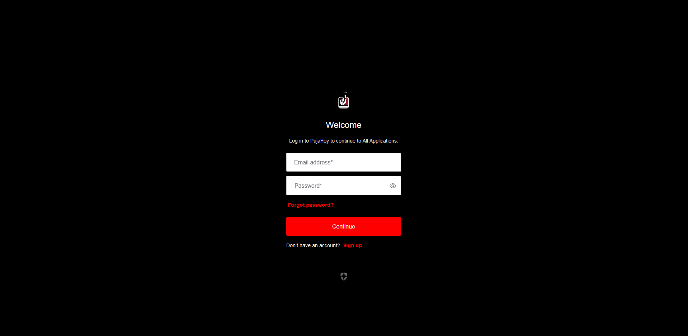
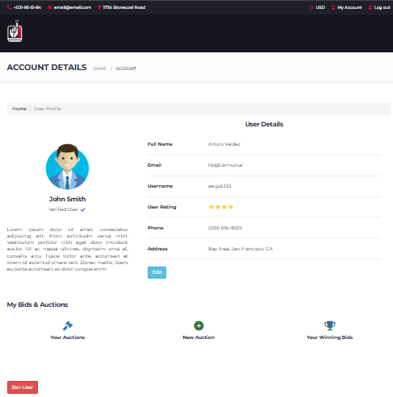
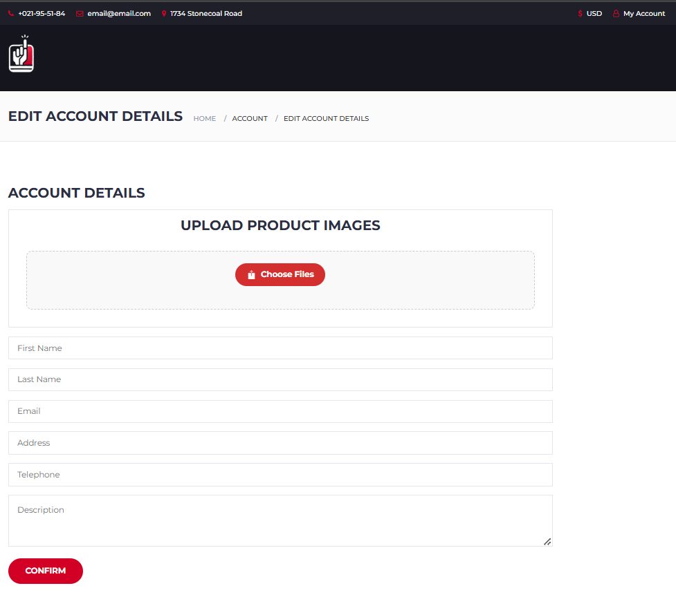

# webapp08
# Aplicación web de subastas "PujaHoy"
## Integrantes
### Jorge Andrés Echevarría j.andres.2022@alumnos.urjc.es jae9104
### Arturo Enrique Gutierrez Mirandona ae.gutierrez.2022@alumnos.urjc.es arturox2500
### Iván Gutiérrez González i.gutierrez.2022@alumnos.urjc.es IvanGutierrrez
### Víctor Bartolomé Letosa v.bartolome.2022@alumnos.urjc.es victorino2324
### Miguel Pradillo Bartolomé	m.pradillo.2020@alumnos.urjc.es	MikePradiBart
## Aspectos principales
### Entidades:
#### Usuario
Guarda el rol, el id y si es usuario registrado guardará su reputación, su método de pago y sus productos públicados.
#### Producto
Guarda todas las ofertas que se realizan sobre el, la transacción final, la hora inicial y final, el precio inicial, los datos del producto (imagen, nombre, etc) y el estado de este (sin verificar, verificado, terminado y vetado).
#### Oferta
Guardará el precio de la puja, la hora a la que se realiza, el usuario que la efectua y el identificador del producto.
#### Transacción
Guarda el precio final, el usuario que vende el producto y el que lo compra y el identificador del producto.
### Tipos de Usuarios:
#### Usuario no registrado
Visualiza los productos, los perfiles de usuarios y el historial de las ofertas.
#### Usuario registrado
Puede publicar productos para subasta, hacer ofertas, realizar transacciones (compra o venta) y valorar a otros usuarios.
#### Administrador
Valida productos y banear o desbanear usuarios y productos.
### Permisos de los usuarios:
Los usuarios registrados pueden ver sus productos publicados (vendidos o no), sus datos personales, los productos sobre los que ha realizado una o varias ofertas y ver el precio de estas.
Y los administradores tendrán acceso a los productos publicados y a las ofertas realizadas de todos los usuarios registrados.
### Imágenes:
Los usuarios pueden subir una o varias imágenes sobre los productos que publican.
### Gráficos:
Los usuarios podrán consultar los gráficos que muestran el historial de ofertas de cada producto publicado.
### Tecnología complementaria:
La aplicación web utilizará Auth0 para la gestión de autentificación y autorización.
### Algoritmo o consulta avanzada:
Al ver los productos publicados se mostrarán en orden según la valoración que tenga el usuario que lo publica.
## Diagrama de la base de datos de la aplicación

## Imagen index

## Imagen Store

## Imagen Product

## Imagen Login

## Imagen Profile

## Imagen New Auction

## Imagen Edit Profile

## Imagen Your Winning Bids y Imagen Your products

## Diagrama de navegación

Aclaraciones:
-> Flechas amarillas = todos los usuarios
-> Flechas azules = usuarios registrados

Todos los ususarios son capaces de acceder a las paginas de Index, Store y Product, excepto que la última mostrará unos botones u otros según el tipo de usuario. 

En el caso de la pagina Profile podrán acceder todos los tipos de usuario pero con pequeñas diferencias en la presentación, por ejemplo, los usuarios registrados tendran a acceso a los botones para acceder a las paginas Add Auction, Your Winning Bids, Your Products y Edit Profile, los usuarios no registrados podrán ver la informacion (no privada) de los usuarios registrados si acceden a su perfil desde sus publicaciones y no tendran acceso a los botones que pertenecen a las acciones de los usuarios registrados, finalmente, los administradores podrán ver la información de los usuarios registrados y tendran acceso a un botón para bloquear a dicho usuario en caso de conductas inapropiadas.

